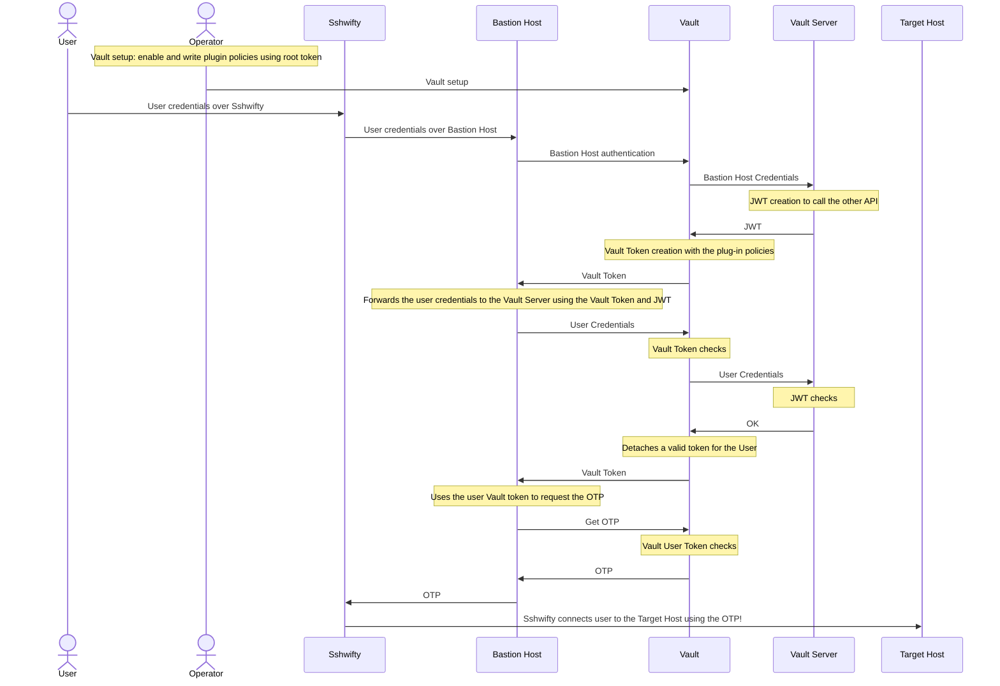

# Implementation of a controlled access system using Bastion Host and Vault
Increasing automation in IT processes and the evolution of software lifecycle processes from a DevOps perspective have meant that there is less and less need to perform direct access to IT systems: typically, access is for the purpose of performing critical operations and extraordinary maintenance.  
Access to such systems therefore should be as limited as possible and subject to strict monitoring of the accesses performed.  
To this end, it is useful to define a single point of access on which to focus security audits: such a system is typically referred to as a bastion host.  
Another critical point in system access is the protection of access keys: these in the enterprise environment are managed in a wide variety of ways, sometimes without any use of protective measures, others with increasingly sophisticated systems such as vaults or HSMs.

The purpose of this thesis project is to implement a system based on bastion hosts, which through the implementation of an authorization workflow, allows granting or denying access to remote systems through the automatic use of keys retrieved from a vault by a bastion host.

## Auth plugin for [HashiCorp Vault](https://www.vaultproject.io/)
The first step in the implementation of the system is the development of an authentication plugin for Vault.  
The plugin is based on the [plugin development guide](https://www.vaultproject.io/docs/internals/plugins.html) provided by HashiCorp and is written in Go.  
The workflow of the plugin under development is as follows:


## Demo


## Instructions
1. Edit the env file with your own values

    ```
    $ nano .env
    ```

2. Starts the vault server
    ```
    $ go run vault_server/cmd/main.go
    ```

3. Starts the bastion host
    ```
    $ go run bastion_host/cmd/main.go
    ```

4. Build and starts the vault plugin
    ```
    $ make
    ```

5. Setup the vault and the plugin
    ```
    $ export VAULT_ADDR=http://$(ipconfig getifaddr en0):8200
    $ make vault-setup
    ```

6. Setup the remote host following the [hashicorp guide for SSH](https://learn.hashicorp.com/tutorials/vault/ssh-otp?in=vault/secrets-management).  
If you have already followed the above instructions before, do this:
    - Starts vagrant
        ```
        $ vagrant up
        ```

    - Connect to the remote host
        ```
        $ vagrant ssh
        ```

    - Change the 'vault_addr' variable with the address of your vault server
        ```
        $ sudo nano /etc/vault-ssh-helper.d/config.hcl
        ```

    - Restart the service
        ```
        $ sudo systemctl restart sshd
        ```

    - Verify that the configuration is correct

        ```
        $ vault-ssh-helper -verify-only -dev -config /etc/vault-ssh-helper.d/config.hcl
        ```
        
    - Exit from the remote host
        ```
        $ exit
        ```

7. (Temporary) Manually change the remote host and bastion host addresses in <b>sshwifty/ui/commands/ssh.js</b> (lines  533, 678, 752)
    ```
    $ cd sshwifty/
    $ npm install
    $ npm run build
    $ go run sshwifty.go
    ```