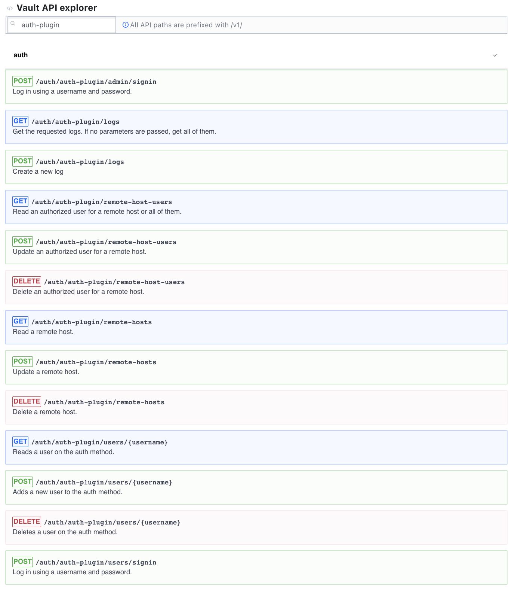
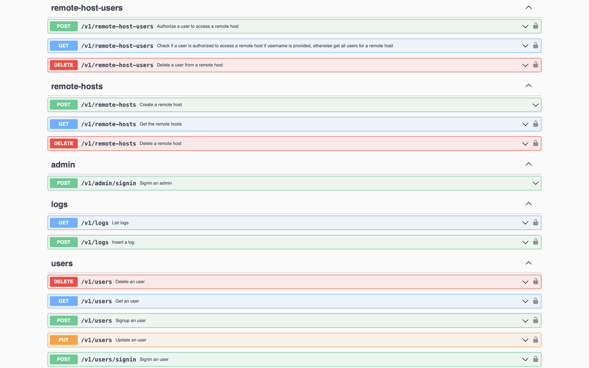

# Implementation of a controlled access system using Bastion Host and Vault
Increasing automation in IT processes and the evolution of software lifecycle processes from a DevOps perspective have meant that there is less and less need to perform direct access to IT systems: typically, access is for the purpose of performing critical operations and extraordinary maintenance.  
Access to such systems therefore should be as limited as possible and subject to strict monitoring of the accesses performed.  
To this end, it is useful to define a single point of access on which to focus security audits: such a system is typically referred to as a bastion host.  
Another critical point in system access is the protection of access keys: these in the enterprise environment are managed in a wide variety of ways, sometimes without any use of protective measures, others with increasingly sophisticated systems such as vaults or HSMs.

## [HashiCorp Vault](https://www.vaultproject.io/) in a few words
Manage Secrets & Protect Sensitive Data
Secure, store and tightly control access to tokens, passwords, certificates, encryption keys for protecting secrets and other sensitive data using a UI, CLI, or HTTP API.

## Thesis puropose
The purpose of this thesis project is to implement a system based on bastion hosts, which through the implementation of an authorization workflow with Vault, allows granting or denying access to remote systems through the automatic use of keys retrieved from a vault by a bastion host.

# Development
In this section we will describe the development of the project, starting from the definition of the architecture, the technologies used and the implementation of the Vault plugin.
## Architecture
The architecture of the system is shown in the following sequence diagram:

## Technologies
The technologies used in the project are:
- [Go](https://golang.org/) as programming language
- [HashiCorp Vault](https://www.vaultproject.io/) as a secret management system
- [Vagrant](https://www.vagrantup.com/) as a virtual machine manager
- [VMWare Fusion](https://www.vmware.com/products/fusion.html) as a virtual machine
- [Docker](https://www.docker.com/) as a container manager
- [Docker Compose](https://docs.docker.com/compose/) as a container orchestrator
- [PostgreSQL](https://www.postgresql.org/) as a database
- [Swagger](https://swagger.io/) as a REST API documentation
- [Sshwifty](https://github.com/nirui/sshwifty) as a SSH web client, with some modifications to allow the communication with the Vault

## Auth plugin for Vault
A crucial step in the implementation of the system is the development of an authorization plugin for Vault.  
The plugin is based on the [plugin development guide](https://www.vaultproject.io/docs/internals/plugins.html).  
The api exposed by the plugin are the following:





Each call to the plugin calls another API of the API Vault Helper, that adds another layer of security to the system because it uses a JWT to authenticate the calls.  
The second API reflects the Vault API, but it is used to detach the JWT token when the bastion host authenticates itself before requesting the other operations.





## Demo


## Instructions
You can run the application with Docker or manually.
### Docker
To run the application with Docker, you need to have [Docker](https://docs.docker.com/get-docker/) installed on your machine.  
To run with Docker, you only need to run the following commands:
1. Get the web client Sshwifty
    ```
    $ git submodule init
    $ git submodule update --remote
    ```
2. Run the Docker compose
    ```
    docker compose up
    ```
3. Take a :coffee:
4. Find the SSH remote host IP address
    ```
    docker inspect ssh-host | grep IPAddress
    ```
    
5. Open the browser at [http://localhost:8182](http://localhost:8182) and enjoy with default username `elliot` and password `mrrobot`.

### Manual
You need to have [Go](https://golang.org/doc/install) and [Node.js](https://nodejs.org/en/download/) installed on your machine.  
I also suggest to use [Vagrant](https://www.vagrantup.com/docs/installation) to setup the remote host.  
As virtual machine provider, you can use any one such as [VirtualBox](https://www.virtualbox.org/wiki/Downloads).  
If you run on macOS Ventura i reccomend to use [VMWare](https://www.vmware.com/products/workstation-pro/workstation-pro-evaluation.html).  
You also need to have a database installed on your machine, I used [PostgreSQL](https://www.postgresql.org/download/).

To launch the application manually, you need to run the following commands:
1. Get the web client Sshwifty
    ```
    $ git submodule init
    $ git submodule update --remote
    ```

2. Edit the env file with your own values
    ```
    $ nano .env
    ```

3. Build and starts the vault plugin
    ```
    $ bash vault-init.sh
    ```

4. Setup the vault and the plugin
    ```
    $ bash vault-setup.sh
    ```
    
5. Starts the server API
    ```
    $ go run api/cmd/main.go
    ```

6. Configure the remote host (adapted from [SSH Secrets Engine: One-Time SSH Password](https://developer.hashicorp.com/vault/tutorials/secrets-management/ssh-otp)):
    - Start vagrant
    ```
    $ vagrant up
    $ vagrant ssh
    ```
    - Download and install version `0.2.1` of `vault-ssh-helper` from [releases.hashicorp.com](releases.hashicorp.com).
    ```
    $ wget https://releases.hashicorp.com/vault-ssh-helper/0.2.1/vault-ssh-helper_0.2.1_linux_amd64.zip
    ```
    - Unzip the binary from the archive into `/usr/local/bin`.
    ```
    $ sudo unzip -q vault-ssh-helper_0.2.1_linux_amd64.zip -d /usr/local/bin
    ```
    - Set the vault-ssh-helper binary's permissions to executable.
    ```
    $ sudo chmod 0755 /usr/local/bin/vault-ssh-helper
    ```
    - Create a directory to store the configuration file.
    ```
    $ sudo mkdir /etc/vault-ssh-helper.d/
    ```
    - Create a Vault SSH Helper configuration file `/etc/vault-ssh-helper.d/config.hcl`
    ```
    $ sudo tee /etc/vault-ssh-helper.d/config.hcl <<EOF
    vault_addr = "$VAULT_ADDR"
    tls_skip_verify = false
    ssh_mount_point = "ssh"
    allowed_roles = "*"
    EOF
    ```
    - Edit PAM sshd configuration file.
    ```
    $ sudo nano /etc/pam.d/sshd
    ```
    The common-auth must be commented out or removed to disable the standard Unix authentication and replaced with authentication through vault-ssh-helper. Finally, a workaround for a bug that exists with some versions of pam_exec.so must also be included.
    ```
    #PAM configuration for the Secure Shell service

    # Standard Un*x authentication.
    # @include common-auth
    auth requisite pam_exec.so quiet expose_authtok log=/var/log/vault-ssh.log /usr/local/bin/vault-ssh-helper -dev -config=/etc/vault-ssh-helper.d/config.hcl
    auth optional pam_unix.so not_set_pass use_first_pass nodelay


    ...
    ```
    - Modify the sshd configuration file.
    ```
    $ sudo nano /etc/ssh/sshd_config
    ```
    - Add or set the following options:
    ```
    KbdInteractiveAuthentication yes
    UsePAM yes
    PasswordAuthentication yes
    ```
    - Restart the service
    ```
    $ sudo systemctl restart sshd
    ```
    - Verify that the configuration is correct
    ```
    $ vault-ssh-helper -verify-only -dev -config /etc/vault-ssh-helper.d/config.hcl
    ```   
    - Find the ipv4 address of the remote host
    ```
    $ ip -4 address show eth1 | grep inet | awk '{print $2}' | cut -d'/' -f1
    ```   
    - Exit from the remote host
    ```
    $ exit
    ```

7. (Optional) If you want to have a Log Management System, you have to install Elastic Stack on your machine.
    - Install [Elasticsearch](https://www.elastic.co/guide/en/elasticsearch/reference/current/install-elasticsearch.html)
    - Install [Kibana](https://www.elastic.co/guide/en/kibana/current/install.html)
    - Install [Logstash](https://www.elastic.co/guide/en/logstash/current/installing-logstash.html)
    - Copy `elasticsearch/logstash/config` in your Logstash installation directory and edit `logs.conf`.
    - Edit `elasticsearch/logstash/pipelines.yml` in your Logstash installation directory and edit `pipelines.yml`.
    - Edit `${YOUR_ELASTIC_SEARCH}/conf/elasticsearch.yml` adding:
        ``` 
            xpack.security.enabled: false
            
            xpack.security.http.ssl:
            enabled: false

            xpack.security.transport.ssl:
            enabled: false 
        ```
    - Edit `${YOUR_KIBANA}/conf/kibana.yml` adding:
        ``` 
            elasticsearch.hosts: ['http://localhost:9200']
            type: elasticsearch, hosts: ['http://localhost:9200']]
        ```

7. Build and starts the web client over the bastion host
    ```
    $ bash sshwifty-run.sh
    ```
 