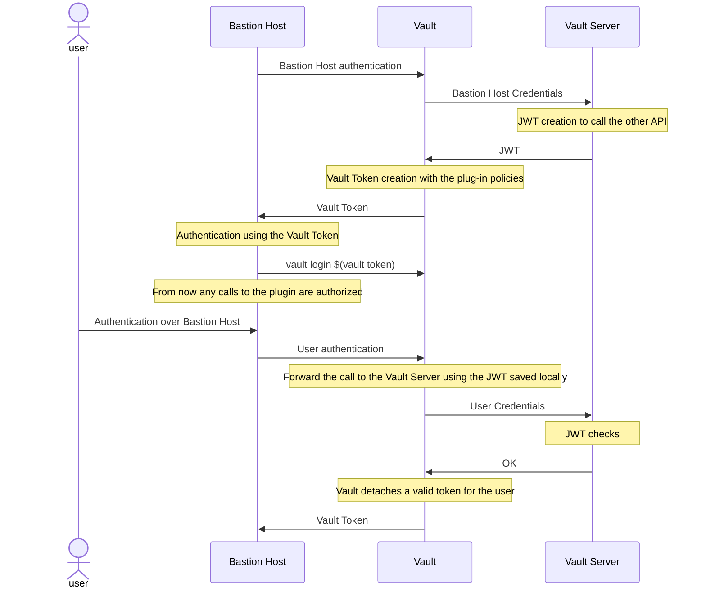

```mermaid
sequenceDiagram
actor user
    participant Bastion Host
    participant Vault
    participant Vault Server
    Bastion Host->>Vault: Bastion Host authentication
    Vault->>Vault Server: Bastion Host Credentials
    Note over Vault Server: JWT creation to call the other API
    Vault Server->>Vault: JWT 
    note over Vault: Vault Token creation with the plug-in policies
    Vault->>Bastion Host: Vault Token 
    note over Bastion Host: Authentication using the Vault Token
    Bastion Host->>Vault: vault login $(vault token)
    note over Bastion Host: From now any calls to the plugin are authorized
    user->>Bastion Host: Authentication over Bastion Host
    Bastion Host->>Vault: User authentication
    note over Vault: Forward the call to the Vault Server using the JWT saved locally
    Vault->>Vault Server: User Credentials
    note over Vault Server: JWT checks
    Vault Server->>Vault: OK
    note over Vault: Vault detaches a valid token for the user
    Vault->>Bastion Host: Vault Token
```